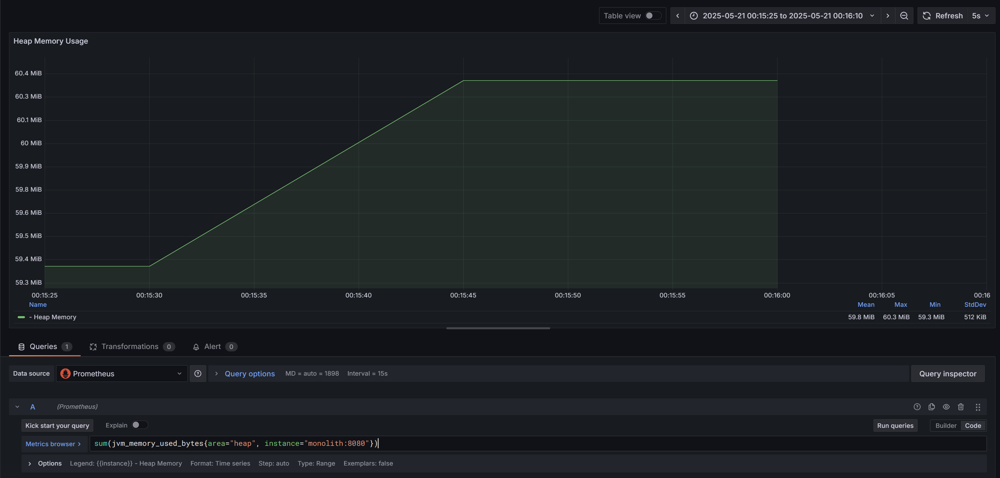
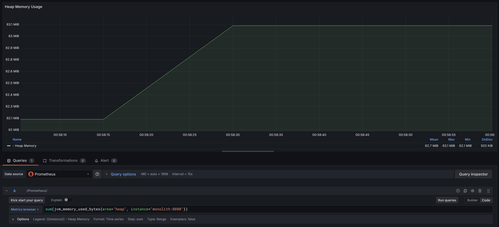
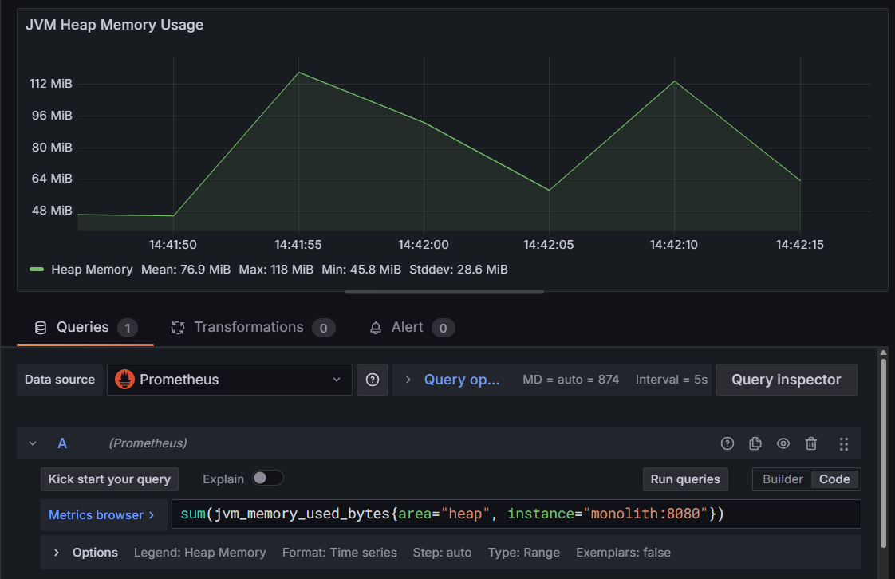
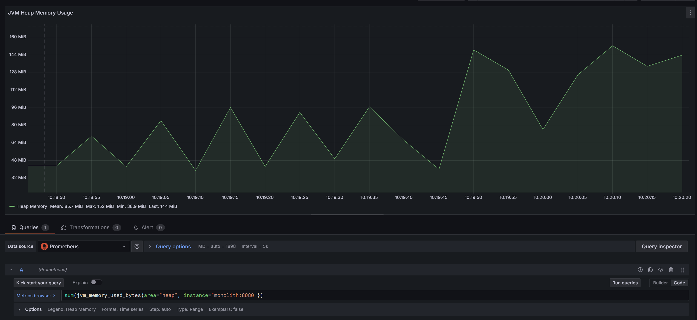
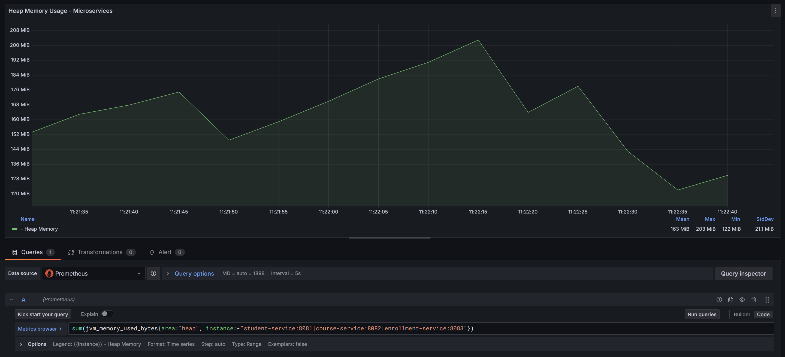
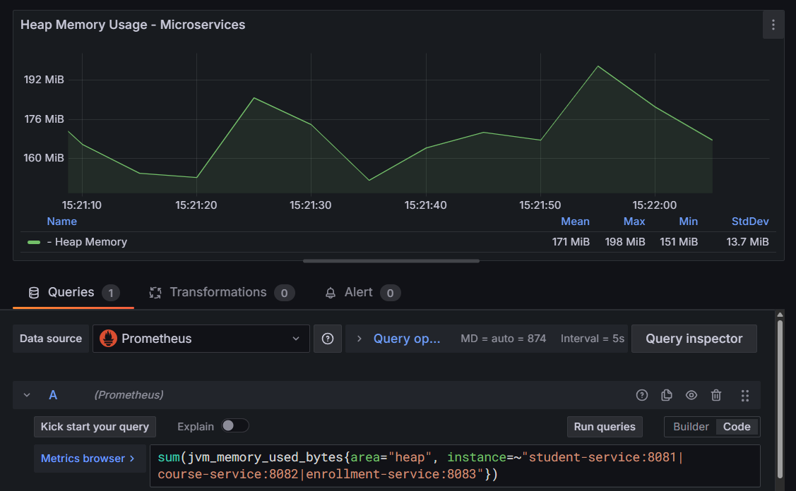
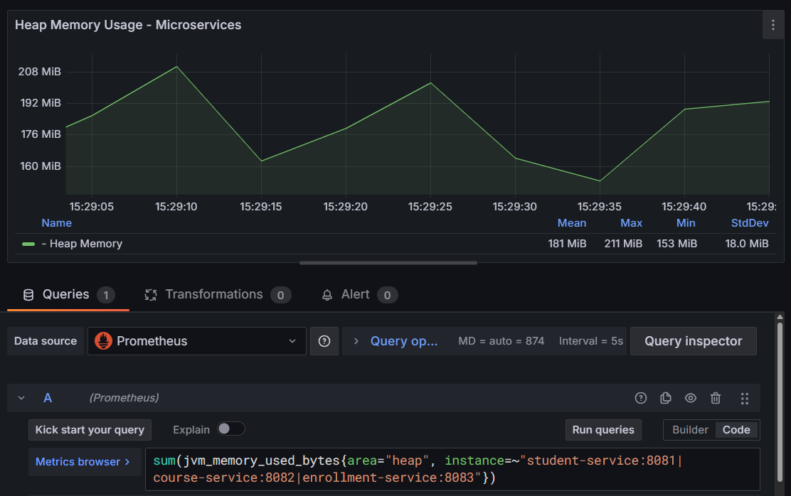
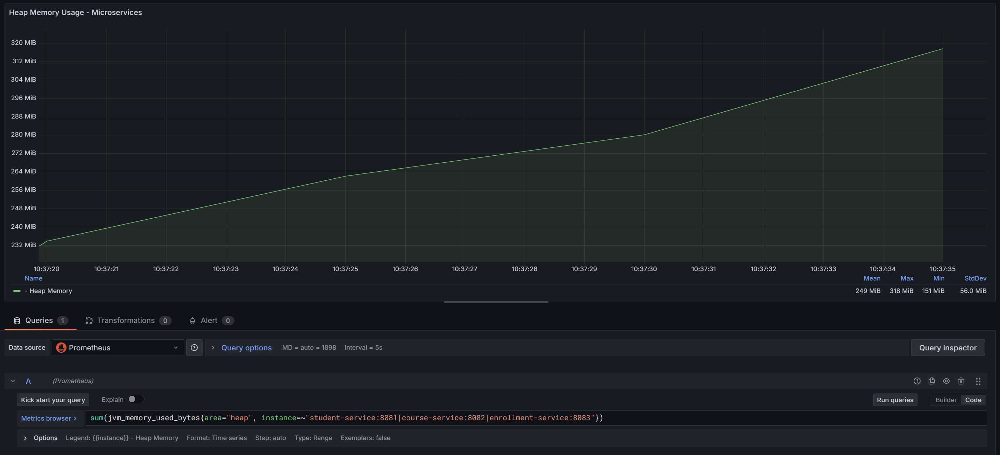

# Memory Consumption Metrics: Monolithic vs Microservices Architecture

## Table of Contents
- [Memory Consumption Metrics: Monolithic vs Microservices Architecture](#memory-consumption-metrics-monolithic-vs-microservices-architecture)
  - [Table of Contents](#table-of-contents)
  - [Monolithic Application Test Runs](#monolithic-application-test-runs)
    - [Run 1 (10 Users)](#run-1-10-users)
    - [Run 2 (50 Users)](#run-2-50-users)
    - [Run 3 (100 Users)](#run-3-100-users)
    - [Run 4 (200 Users)](#run-4-200-users)
  - [Microservices Application Test Runs](#microservices-application-test-runs)
    - [Microservices Memory Stats (Heap Usage)](#microservices-memory-stats-heap-usage)
    - [Monolith Memory Stats](#monolith-memory-stats)
  - [Monolith vs Microservices Memory Stats](#monolith-vs-microservices-memory-stats)
    - [Run 1 (10 Users) - Microservices](#run-1-10-users---microservices)
    - [Run 2 (50 Users) - Microservices](#run-2-50-users---microservices)
    - [Run 3 (100 Users) - Microservices](#run-3-100-users---microservices)
    - [Run 4 (200 Users) - Microservices](#run-4-200-users---microservices)

## Monolithic Application Test Runs

### Run 1 (10 Users)

Memory Consumption Metrics:
- Mean: 59.8 MiB
- Max: 60.3 MiB
- Min: 59.3 MiB
- StdDev: 512 KiB

Performance Metrics:
- Throughput: 203.94 requests/sec
- Average Response Time: 15ms
- Min Response Time: 3ms
- Max Response Time: 298ms
- Error Rate: 0%
- Total Data Transfer: 548.49 KB/sec received, 37.34 KB/sec sent

**Summary Table**

| Label | # Samples | Average | Min | Max | Std. Dev. | Error % | Throughput | Received KB/sec | Sent KB/sec | Avg. Bytes |
|-------|-----------|---------|-----|-----|-----------|---------|------------|-----------------|-------------|------------|
| Get All Students | 200 | 7 | 3 | 298 | 21.09 | 0.000% | 34.28767 | 112.07 | 4.19 | 3346.9 |
| Create Student | 200 | 23 | 10 | 149 | 10.76 | 0.000% | 36.07504 | 7.20 | 8.46 | 204.5 |
| Get All Courses | 200 | 5 | 3 | 11 | 1.41 | 0.000% | 37.03704 | 121.02 | 4.48 | 3345.8 |
| Create Course | 200 | 22 | 12 | 48 | 6.00 | 0.000% | 37.00962 | 7.34 | 8.64 | 203.0 |
| Get All Enrollments | 200 | 7 | 4 | 36 | 4.79 | 0.000% | 37.22315 | 332.97 | 4.65 | 9160.1 |
| Create Enrollment | 200 | 26 | 13 | 73 | 8.47 | 0.000% | 37.20930 | 9.57 | 9.77 | 263.5 |
| TOTAL | 1200 | 15 | 3 | 298 | 13.94 | 0.000% | 203.94290 | 548.49 | 37.34 | 2754.0 |

**Aggregate Table**

| Label | # Samples | Average | Median | 90% Line | 95% Line | 99% Line | Min | Max | Error % | Throughput | Received KB/sec | Sent KB/sec |
|-------|-----------|---------|--------|----------|----------|----------|-----|-----|---------|------------|-----------------|-------------|
| Get All Students | 200 | 7 | 5 | 8 | 12 | 30 | 3 | 298 | 0.000% | 34.28767 | 112.07 | 4.19 |
| Create Student | 200 | 23 | 22 | 31 | 35 | 47 | 10 | 149 | 0.000% | 36.07504 | 7.20 | 8.46 |
| Get All Courses | 200 | 5 | 5 | 7 | 7 | 9 | 3 | 11 | 0.000% | 37.03704 | 121.02 | 4.48 |
| Create Course | 200 | 22 | 21 | 31 | 35 | 37 | 12 | 48 | 0.000% | 37.00962 | 7.34 | 8.64 |
| Get All Enrollments | 200 | 7 | 6 | 9 | 14 | 28 | 4 | 36 | 0.000% | 37.22315 | 332.97 | 4.65 |
| Create Enrollment | 200 | 26 | 25 | 35 | 45 | 54 | 13 | 73 | 0.000% | 37.20930 | 9.57 | 9.77 |
| TOTAL | 1200 | 15 | 15 | 28 | 33 | 47 | 3 | 298 | 0.000% | 203.94290 | 548.49 | 37.34 |

### Run 2 (50 Users)

Memory Consumption Metrics:
- Mean: 62.7 MiB
- Max: 63.1 MiB
- Min: 62.1 MiB
- StdDev: 502 KiB

**Summary Table**

| Label | # Samples | Average | Min | Max | Std. Dev. | Error % | Throughput | Received KB/sec | Sent KB/sec | Avg. Bytes |
|-------|-----------|---------|-----|-----|-----------|---------|------------|-----------------|-------------|------------|
| Get All Students | 1000 | 5 | 3 | 160 | 6.88 | 0.000% | 47.52852 | 767.45 | 5.80 | 16534.7 |
| Create Student | 1000 | 22 | 10 | 126 | 6.84 | 0.000% | 47.86063 | 9.58 | 11.22 | 204.9 |
| Get All Courses | 1000 | 4 | 3 | 16 | 1.25 | 0.000% | 48.14173 | 777.38 | 5.83 | 16535.2 |
| Create Course | 1000 | 22 | 12 | 147 | 9.09 | 0.000% | 48.13014 | 9.56 | 11.23 | 203.4 |
| Get All Enrollments | 1000 | 7 | 4 | 42 | 4.91 | 0.000% | 48.19277 | 2163.18 | 6.02 | 45963.2 |
| Create Enrollment | 1000 | 24 | 11 | 103 | 8.19 | 0.000% | 48.19045 | 12.42 | 12.66 | 263.9 |
| TOTAL | 6000 | 14 | 3 | 160 | 10.97 | 0.000% | 284.49502 | 3690.72 | 52.09 | 13284.2 |

**Aggregate Table**

| Label | # Samples | Average | Median | 90% Line | 95% Line | 99% Line | Min | Max | Error % | Throughput | Received KB/sec | Sent KB/sec |
|-------|-----------|---------|--------|----------|----------|----------|-----|-----|---------|------------|-----------------|-------------|
| Get All Students | 1000 | 5 | 5 | 7 | 12 | 30 | 3 | 160 | 0.000% | 47.52852 | 767.45 | 5.80 |
| Create Student | 1000 | 22 | 21 | 29 | 34 | 45 | 10 | 126 | 0.000% | 47.86063 | 9.58 | 11.22 |
| Get All Courses | 1000 | 4 | 4 | 6 | 7 | 9 | 3 | 16 | 0.000% | 48.14173 | 777.38 | 5.83 |
| Create Course | 1000 | 22 | 20 | 29 | 35 | 48 | 12 | 147 | 0.000% | 48.13014 | 9.56 | 11.23 |
| Get All Enrollments | 1000 | 7 | 6 | 9 | 20 | 28 | 4 | 42 | 0.000% | 48.19277 | 2163.18 | 6.02 |
| Create Enrollment | 1000 | 24 | 23 | 33 | 41 | 53 | 11 | 103 | 0.000% | 48.19045 | 12.42 | 12.66 |
| TOTAL | 6000 | 14 | 15 | 27 | 31 | 45 | 3 | 160 | 0.000% | 284.49502 | 3690.72 | 52.09 |

### Run 3 (100 Users)

Memory Consumption Metrics:
- Mean: 76.9 MiB
- Max: 118 MiB
- Min: 45.8 MiB
- StdDev: 28.6 MiB

**Summary Table**

| Label | # Samples | Average | Min | Max | Std. Dev. | Error % | Throughput | Received KB/sec | Sent KB/sec | Avg. Bytes |
|-------|-----------|---------|-----|-----|-----------|---------|------------|-----------------|-------------|------------|
| Get All Students | 2000 | 24 | 7 | 1099 | 53.09 | 0.000% | 23.91372 | 766.28 | 2.92 | 32812.8 |
| Create Student | 2000 | 45 | 16 | 767 | 48.39 | 0.000% | 24.19111 | 4.85 | 5.67 | 205.4 |
| Get All Courses | 2000 | 17 | 7 | 316 | 18.31 | 0.000% | 24.27479 | 777.89 | 2.94 | 32814.3 |
| Create Course | 2000 | 45 | 14 | 398 | 42.10 | 0.000% | 24.25154 | 4.83 | 5.66 | 204.0 |
| Get All Enrollments | 2000 | 25 | 9 | 225 | 21.84 | 0.000% | 24.23626 | 2151.68 | 3.03 | 90910.0 |
| Create Enrollment | 2000 | 50 | 19 | 472 | 44.93 | 0.000% | 24.15430 | 6.24 | 6.35 | 264.4 |
| TOTAL | 12000 | 35 | 7 | 1099 | 42.27 | 0.000% | 138.85996 | 3553.11 | 25.43 | 26201.8 |

**Aggregate Table**

| Label | # Samples | Average | Median | 90% Line | 95% Line | 99% Line | Min | Max | Error % | Throughput | Received KB/sec | Sent KB/sec |
|-------|-----------|---------|--------|----------|----------|----------|-----|-----|---------|------------|-----------------|-------------|
| Get All Students | 2000 | 24 | 13 | 37 | 69 | 238 | 7 | 1099 | 0.000% | 23.91372 | 766.28 | 2.92 |
| Create Student | 2000 | 45 | 31 | 82 | 125 | 277 | 16 | 767 | 0.000% | 24.19111 | 4.85 | 5.67 |
| Get All Courses | 2000 | 17 | 13 | 28 | 42 | 89 | 7 | 316 | 0.000% | 24.27479 | 777.89 | 2.94 |
| Create Course | 2000 | 45 | 31 | 82 | 123 | 238 | 14 | 398 | 0.000% | 24.25154 | 4.83 | 5.66 |
| Get All Enrollments | 2000 | 25 | 19 | 48 | 70 | 111 | 9 | 225 | 0.000% | 24.23626 | 2151.68 | 3.03 |
| Create Enrollment | 2000 | 50 | 36 | 87 | 133 | 255 | 19 | 472 | 0.000% | 24.15430 | 6.24 | 6.35 |
| TOTAL | 12000 | 35 | 25 | 65 | 97 | 219 | 7 | 1099 | 0.000% | 138.85996 | 3553.11 | 25.43 |

### Run 4 (200 Users)

Memory Consumption Metrics:
- Mean: 85.7 MiB
- Max: 152 MiB
- Min: 38.9 MiB
- StdDev: 44.2 MiB

**Summary Table**

| Label | # Samples | Average | Min | Max | Std. Dev. | Error % | Throughput | Received KB/sec | Sent KB/sec | Avg. Bytes |
|-------|-----------|---------|-----|-----|-----------|---------|------------|-----------------|-------------|------------|
| Get All Students | 4000 | 10 | 3 | 412 | 12.07 | 0.000% | 50.08326 | 3238.93 | 6.11 | 66223.1 |
| Create Student | 4000 | 24 | 9 | 200 | 11.84 | 0.000% | 50.27778 | 10.10 | 11.78 | 205.7 |
| Get All Courses | 4000 | 9 | 2 | 88 | 7.59 | 0.000% | 50.32586 | 3254.49 | 6.09 | 66220.4 |
| Create Course | 4000 | 24 | 7 | 175 | 10.44 | 0.000% | 50.25189 | 10.02 | 11.73 | 204.3 |
| Get All Enrollments | 4000 | 14 | 3 | 166 | 12.55 | 0.000% | 50.30244 | 8965.18 | 6.29 | 182503.0 |
| Create Enrollment | 4000 | 26 | 11 | 134 | 10.26 | 0.000% | 50.23863 | 12.99 | 13.20 | 264.7 |
| TOTAL | 24000 | 18 | 2 | 412 | 13.03 | 0.000% | 290.94083 | 14945.81 | 53.27 | 52603.5 |

**Aggregate Table**

| Label | # Samples | Average | Median | 90% Line | 95% Line | 99% Line | Min | Max | Error % | Throughput | Received KB/sec | Sent KB/sec |
|-------|-----------|---------|--------|----------|----------|----------|-----|-----|---------|------------|-----------------|-------------|
| Get All Students | 4000 | 10 | 8 | 22 | 27 | 56 | 3 | 412 | 0.000% | 50.08326 | 3238.93 | 6.11 |
| Create Student | 4000 | 24 | 22 | 35 | 43 | 71 | 9 | 200 | 0.000% | 50.27778 | 10.10 | 11.78 |
| Get All Courses | 4000 | 9 | 7 | 15 | 20 | 49 | 2 | 88 | 0.000% | 50.32586 | 3254.49 | 6.09 |
| Create Course | 4000 | 24 | 22 | 35 | 41 | 65 | 7 | 175 | 0.000% | 50.25189 | 10.02 | 11.73 |
| Get All Enrollments | 4000 | 14 | 11 | 26 | 39 | 64 | 3 | 166 | 0.000% | 50.30244 | 8965.18 | 6.29 |
| Create Enrollment | 4000 | 26 | 25 | 37 | 46 | 76 | 11 | 134 | 0.000% | 50.23863 | 12.99 | 13.20 |
| TOTAL | 24000 | 18 | 17 | 32 | 39 | 64 | 2 | 412 | 0.000% | 290.94083 | 14945.81 | 53.27 |

## Microservices Application Test Runs

### Microservices Memory Stats (Heap Usage)

| Testimi | Mean   | Max   | Min   | StdDev  |
|---------|--------|-------|-------|---------|
| 10u     | 163 MiB| 203 MiB| 122 MiB| 21.1 MiB |
| 50u     | 171 MiB| 198 MiB| 151 MiB| 13.7 MiB |
| 100u    | 181 MiB| 211 MiB| 153 MiB| 18.0 MiB |
| 200u    | 249 MiB| 318 MiB| 151 MiB| 56.0 MiB |

### Monolith Memory Stats

| Testimi | Mean    | Max     | Min     | StdDev   |
|---------|---------|---------|---------|----------|
| 10u     | 59.8 MiB| 60.3 MiB| 59.3 MiB| 512 KiB  |
| 50u     | 62.7 MiB| 63.1 MiB| 62.1 MiB| 502 KiB  |
| 100u    | 76.9 MiB| 118 MiB | 45.8 MiB| 28.6 MiB |
| 200u    | 85.7 MiB| 152 MiB | 38.9 MiB| 44.2 MiB |

## Monolith vs Microservices Memory Stats

| Testimi | Monolith Mean | Microservices Mean | Monolith Max | Microservices Max | Monolith Min | Microservices Min | Monolith StdDev | Microservices StdDev |
|---------|---------------|-------------------|--------------|-------------------|--------------|-------------------|------------------|----------------------|
| 10u     | 59.8 MiB      | 163 MiB           | 60.3 MiB     | 203 MiB           | 59.3 MiB     | 122 MiB           | 512 KiB          | 21.1 MiB             |
| 50u     | 62.7 MiB      | 171 MiB           | 63.1 MiB     | 198 MiB           | 62.1 MiB     | 151 MiB           | 502 KiB          | 13.7 MiB             |
| 100u    | 76.9 MiB      | 181 MiB           | 118 MiB      | 211 MiB           | 45.8 MiB     | 153 MiB           | 28.6 MiB         | 18.0 MiB             |
| 200u    | 85.7 MiB      | 249 MiB           | 152 MiB      | 318 MiB           | 38.9 MiB     | 151 MiB           | 44.2 MiB         | 56.0 MiB             |

### Run 1 (10 Users) - Microservices

Memory Consumption Metrics:
- Mean: 163 MiB
- Max: 203 MiB
- Min: 122 MiB
- StdDev: 21.1 MiB

Performance Metrics:
- Throughput: 15.33 requests/sec
- Average Response Time: 14ms
- Min Response Time: 4ms
- Max Response Time: 287ms
- Error Rate: 0%
- Total Data Transfer: 28.78 KB/sec received, 2.95 KB/sec sent

**Summary Table**

| Label | # Samples | Average | Min | Max | Std. Dev. | Error % | Throughput | Received KB/sec | Sent KB/sec | Avg. Bytes |
|-------|-----------|---------|-----|-----|-----------|---------|------------|-----------------|-------------|------------|
| View All Students | 200 | 8 | 4 | 276 | 19.88 | 0.000% | 2.64313 | 9.13 | 0.32 | 3535.2 |
| Create Student | 200 | 20 | 11 | 179 | 14.71 | 0.000% | 2.64795 | 0.53 | 0.63 | 206.6 |
| View All Courses | 200 | 8 | 4 | 262 | 18.54 | 0.000% | 2.65728 | 9.18 | 0.32 | 3539.1 |
| Create Course | 200 | 20 | 13 | 161 | 13.83 | 0.000% | 2.66464 | 0.54 | 0.63 | 206.6 |
| View All Enrollments | 200 | 8 | 4 | 287 | 20.50 | 0.000% | 2.67065 | 10.01 | 0.33 | 3839.6 |
| Create Enrollment | 200 | 20 | 12 | 203 | 15.69 | 0.000% | 2.67877 | 0.55 | 0.84 | 209.7 |
| TOTAL | 1200 | 14 | 4 | 287 | 18.37 | 0.000% | 15.32743 | 28.78 | 2.95 | 1922.8 |

**Aggregate Table**

| Label | # Samples | Average | Median | 90% Line | 95% Line | 99% Line | Min | Max | Error % | Throughput | Received KB/sec | Sent KB/sec |
|-------|-----------|---------|--------|----------|----------|----------|-----|-----|---------|------------|-----------------|-------------|
| View All Students | 200 | 8 | 6 | 9 | 23 | 32 | 4 | 276 | 0.000% | 2.64313 | 9.13 | 0.32 |
| Create Student | 200 | 20 | 17 | 30 | 46 | 64 | 11 | 179 | 0.000% | 2.64795 | 0.53 | 0.63 |
| View All Courses | 200 | 8 | 6 | 9 | 23 | 30 | 4 | 262 | 0.000% | 2.65728 | 9.18 | 0.32 |
| Create Course | 200 | 20 | 16 | 33 | 48 | 56 | 13 | 161 | 0.000% | 2.66464 | 0.54 | 0.63 |
| View All Enrollments | 200 | 8 | 6 | 8 | 16 | 27 | 4 | 287 | 0.000% | 2.67065 | 10.01 | 0.33 |
| Create Enrollment | 200 | 20 | 17 | 27 | 42 | 64 | 12 | 203 | 0.000% | 2.67877 | 0.55 | 0.84 |
| TOTAL | 1200 | 14 | 14 | 23 | 34 | 64 | 4 | 287 | 0.000% | 15.32743 | 28.78 | 2.95 |

### Run 2 (50 Users) - Microservices

Memory Consumption Metrics:
- Mean: 171 MiB
- Max: 198 MiB
- Min: 151 MiB
- StdDev: 13.7 MiB

**Summary Table**

| Label | # Samples | Average | Min | Max | Std. Dev. | Error % | Throughput | Received KB/sec | Sent KB/sec | Avg. Bytes |
|-------|-----------|---------|-----|-----|-----------|---------|------------|-----------------|-------------|------------|
| View All Students | 1000 | 20 | 8 | 297 | 23.08 | 0.000% | 12.30497 | 212.53 | 1.50 | 17686.4 |
| Create Student | 1000 | 32 | 17 | 314 | 17.65 | 0.000% | 12.33274 | 2.50 | 2.92 | 207.7 |
| View All Courses | 1000 | 21 | 8 | 508 | 29.77 | 0.000% | 12.38068 | 213.83 | 1.50 | 17686.2 |
| Create Course | 1000 | 32 | 16 | 365 | 19.73 | 0.000% | 12.41141 | 2.52 | 2.93 | 207.7 |
| View All Enrollments | 1000 | 21 | 9 | 389 | 27.12 | 0.000% | 12.47552 | 238.16 | 1.56 | 19548.4 |
| Create Enrollment | 1000 | 33 | 17 | 370 | 23.08 | 0.000% | 12.55052 | 2.59 | 3.95 | 211.5 |
| TOTAL | 6000 | 26 | 8 | 508 | 24.50 | 0.000% | 71.58367 | 647.19 | 13.80 | 9258.0 |

**Aggregate Table**

| Label | # Samples | Average | Median | 90% Line | 95% Line | 99% Line | Min | Max | Error % | Throughput | Received KB/sec | Sent KB/sec |
|-------|-----------|---------|--------|----------|----------|----------|-----|-----|---------|------------|-----------------|-------------|
| View All Students | 1000 | 20 | 12 | 32 | 61 | 129 | 8 | 297 | 0.000% | 12.30497 | 212.53 | 1.50 |
| Create Student | 1000 | 32 | 28 | 45 | 58 | 110 | 17 | 314 | 0.000% | 12.33274 | 2.50 | 2.92 |
| View All Courses | 1000 | 21 | 12 | 33 | 68 | 128 | 8 | 508 | 0.000% | 12.38068 | 213.83 | 1.50 |
| Create Course | 1000 | 32 | 28 | 48 | 62 | 99 | 16 | 365 | 0.000% | 12.41141 | 2.52 | 2.93 |
| View All Enrollments | 1000 | 21 | 13 | 31 | 68 | 135 | 9 | 389 | 0.000% | 12.47552 | 238.16 | 1.56 |
| Create Enrollment | 1000 | 33 | 28 | 46 | 58 | 134 | 17 | 370 | 0.000% | 12.55052 | 2.59 | 3.95 |
| TOTAL | 6000 | 26 | 23 | 44 | 62 | 126 | 8 | 508 | 0.000% | 71.58367 | 647.19 | 13.80 |

### Run 3 (100 Users) - Microservices

Memory Consumption Metrics:
- Mean: 181 MiB
- Max: 211 MiB
- Min: 153 MiB
- StdDev: 18.0 MiB

**Summary Table**

| Label | # Samples | Average | Min | Max | Std. Dev. | Error % | Throughput | Received KB/sec | Sent KB/sec | Avg. Bytes |
|-------|-----------|---------|-----|-----|-----------|---------|------------|-----------------|-------------|------------|
| View All Students | 2000 | 22 | 8 | 529 | 26.51 | 0.000% | 24.60297 | 857.04 | 3.00 | 35670.8 |
| Create Student | 2000 | 32 | 16 | 284 | 16.05 | 0.000% | 24.75952 | 5.04 | 5.87 | 208.4 |
| View All Courses | 2000 | 23 | 8 | 681 | 39.07 | 0.000% | 24.80036 | 863.90 | 3.00 | 35670.3 |
| Create Course | 2000 | 32 | 16 | 272 | 15.92 | 0.000% | 24.90722 | 5.07 | 5.88 | 208.4 |
| View All Enrollments | 2000 | 24 | 9 | 561 | 37.45 | 0.000% | 24.97097 | 963.47 | 3.12 | 39509.6 |
| Create Enrollment | 2000 | 32 | 18 | 305 | 17.51 | 0.000% | 25.11900 | 5.21 | 7.92 | 212.3 |
| TOTAL | 12000 | 27 | 8 | 681 | 27.63 | 0.000% | 142.94734 | 2593.70 | 27.56 | 18579.9 |

**Aggregate Table**

| Label | # Samples | Average | Median | 90% Line | 95% Line | 99% Line | Min | Max | Error % | Throughput | Received KB/sec | Sent KB/sec |
|-------|-----------|---------|--------|----------|----------|----------|-----|-----|---------|------------|-----------------|-------------|
| View All Students | 2000 | 22 | 14 | 41 | 74 | 123 | 8 | 529 | 0.000% | 24.60297 | 857.04 | 3.00 |
| Create Student | 2000 | 32 | 29 | 46 | 55 | 94 | 16 | 284 | 0.000% | 24.75952 | 5.04 | 5.87 |
| View All Courses | 2000 | 23 | 14 | 38 | 76 | 132 | 8 | 681 | 0.000% | 24.80036 | 863.90 | 3.00 |
| Create Course | 2000 | 32 | 29 | 45 | 57 | 95 | 16 | 272 | 0.000% | 24.90722 | 5.07 | 5.88 |
| View All Enrollments | 2000 | 24 | 15 | 43 | 78 | 148 | 9 | 561 | 0.000% | 24.97097 | 963.47 | 3.12 |
| Create Enrollment | 2000 | 32 | 29 | 45 | 56 | 84 | 18 | 305 | 0.000% | 25.11900 | 5.21 | 7.92 |
| TOTAL | 12000 | 27 | 23 | 45 | 64 | 118 | 8 | 681 | 0.000% | 142.94734 | 2593.70 | 27.56 |

### Run 4 (200 Users) - Microservices

Memory Consumption Metrics:
- Mean: 249 MiB
- Max: 318 MiB
- Min: 151 MiB
- StdDev: 56.0 MiB

**Summary Table**

| Label | # Samples | Average | Min | Max | Std. Dev. | Error % | Throughput | Received KB/sec | Sent KB/sec | Avg. Bytes |
|-------|-----------|---------|-----|-----|-----------|---------|------------|-----------------|-------------|------------|
| View All Students | 4000 | 12 | 4 | 228 | 10.77 | 0.000% | 49.93197 | 3552.73 | 6.10 | 72859.1 |
| Create Student | 4000 | 25 | 9 | 181 | 10.81 | 0.000% | 50.05631 | 10.23 | 11.90 | 209.2 |
| View All Courses | 4000 | 12 | 3 | 309 | 13.35 | 0.000% | 50.12092 | 3566.42 | 6.07 | 72864.1 |
| Create Course | 4000 | 25 | 10 | 147 | 10.71 | 0.000% | 50.24053 | 10.26 | 11.90 | 209.2 |
| View All Enrollments | 4000 | 12 | 4 | 349 | 14.14 | 0.000% | 50.36768 | 4008.04 | 6.30 | 81485.4 |
| Create Enrollment | 4000 | 26 | 10 | 212 | 11.84 | 0.000% | 50.43882 | 10.52 | 15.96 | 213.6 |
| TOTAL | 24000 | 19 | 3 | 349 | 13.75 | 0.000% | 290.71176 | 10780.59 | 56.16 | 37973.4 |

**Aggregate Table**

| Label | # Samples | Average | Median | 90% Line | 95% Line | 99% Line | Min | Max | Error % | Throughput | Received KB/sec | Sent KB/sec |
|-------|-----------|---------|--------|----------|----------|----------|-----|-----|---------|------------|-----------------|-------------|
| View All Students | 4000 | 12 | 9 | 23 | 32 | 54 | 4 | 228 | 0.000% | 49.93197 | 3552.73 | 6.10 |
| Create Student | 4000 | 25 | 23 | 36 | 45 | 65 | 9 | 181 | 0.000% | 50.05631 | 10.23 | 11.90 |
| View All Courses | 4000 | 12 | 9 | 24 | 32 | 55 | 3 | 309 | 0.000% | 50.12092 | 3566.42 | 6.07 |
| Create Course | 4000 | 25 | 23 | 37 | 44 | 65 | 10 | 147 | 0.000% | 50.24053 | 10.26 | 11.90 |
| View All Enrollments | 4000 | 12 | 9 | 24 | 33 | 53 | 4 | 349 | 0.000% | 50.36768 | 4008.04 | 6.30 |
| Create Enrollment | 4000 | 26 | 23 | 37 | 46 | 76 | 10 | 212 | 0.000% | 50.43882 | 10.52 | 15.96 |
| TOTAL | 24000 | 19 | 18 | 32 | 40 | 62 | 3 | 349 | 0.000% | 290.71176 | 10780.59 | 56.16 | 